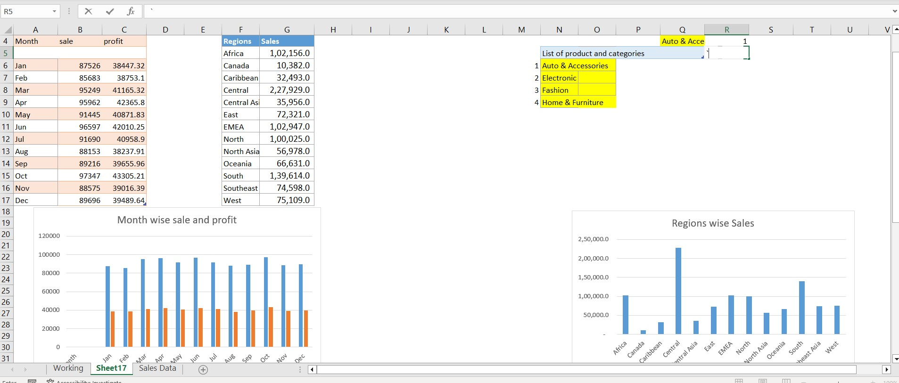

# Designing a Sales dashboard in Excel
#

- In this project I have Design a sales dashboard that analyzes the sales based on various product categories and added user control for product categories so that users can select a category and can see the trend month-wise and product-wise accordingly.

- In image, we can see the data from which, we have to gain insights

- By this data, I have created a report which shows profits and sales by region wise and also it shows the Column Chart of the month-wise table and region-wise table.

#

- When the user scrolls the R4, that time the data changes, and user can see appropriate data of that region or month. For this interactive changes I have Link the table with a combo box and written formula of Sumifs in sale and profit cells.
